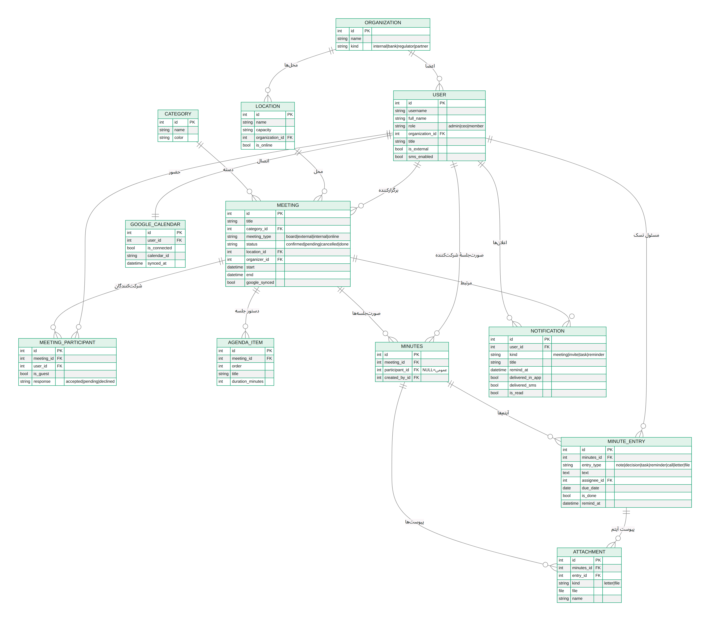
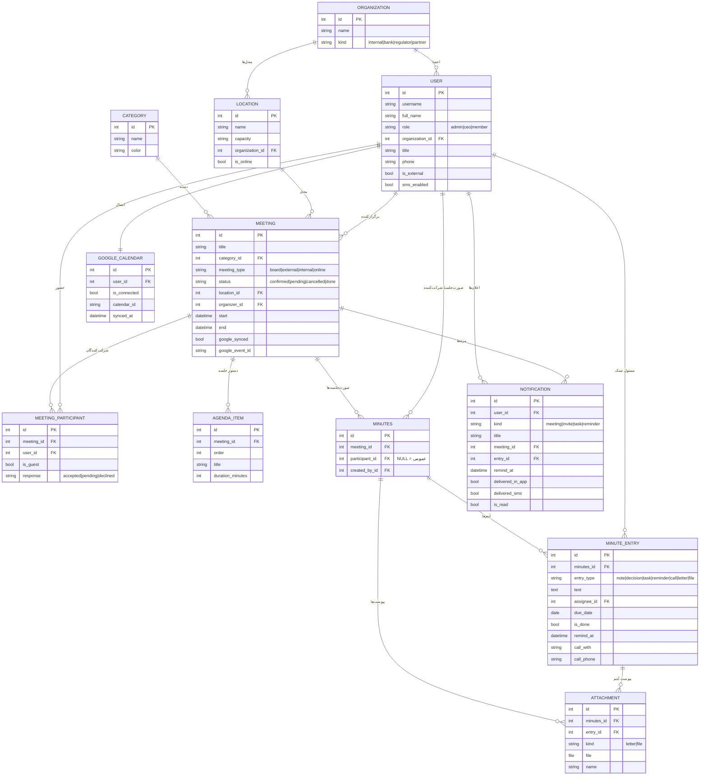

# ERD — بک‌اند مدیریت جلسات گرین‌پی

نمودار موجودیت‑رابطه (ERD) برای مدل‌های Django در `meetings/models.py`.

**تصاویر آماده:** [`erd.png`](./erd.png) · [`erd.svg`](./erd.svg)

## توضیح موجودیت‌ها

| موجودیت | نقش | نکات کلیدی |
|---|---|---|
| **Organization** | سازمان/شرکت | داخلی، بانک، رگولاتور، شریک |
| **User** | فرد (کارمند یا مهمان) | `role` سطح دسترسی؛ `is_external` مهمان خارجی؛ متصل به سازمان |
| **Location** | محل جلسه | متصل به سازمان؛ `is_online` برای Google Meet |
| **Category** | دستهٔ جلسه | فیلتر جلسات (هیئت مدیره، بانکی، …) |
| **Meeting** | جلسه | دسته، محل، برگزارکننده، بازهٔ زمانی، وضعیت همگام‌سازی گوگل |
| **MeetingParticipant** | جدول واسط | شرکت‌کننده/مهمان + پاسخ دعوت (accepted/pending/declined) |
| **AgendaItem** | دستور جلسه | فهرست موضوعات به‌ترتیب با مدت |
| **Minutes** | صورت‌جلسه | **یکتا به‌ازای (جلسه، شرکت‌کننده)**؛ `participant=NULL` یعنی عمومی |
| **MinuteEntry** | آیتم صورت‌جلسه | یادداشت/تصمیم/تسک/یادآور/تماس/نامه/فایل؛ فیلدهای تسک و یادآور و تماس |
| **Attachment** | پیوست | نامه/فایل متصل به صورت‌جلسه (و به‌صورت اختیاری یک آیتم) |
| **Notification** | اعلان | یادآور ۳۰ دقیقه قبل؛ `delivered_in_app` و `delivered_sms` |
| **GoogleCalendarConnection** | اتصال گوگل | `calendar_id` برای کلندر موازی |

## نگاشت به فرانت‌اند
- «تعریف‌ها» → `Organization` / `User` / `Location`
- «دسته‌بندی جلسه» → `Category`
- «دعوت‌نامه‌ها» و پاسخ آن‌ها → `MeetingParticipant.response`
- «دستور جلسه» → `AgendaItem`
- «صورت‌جلسهٔ به‌ازای هر شرکت‌کننده» → `Minutes` (participant) + `MinuteEntry` + `Attachment`
- «یادآورها/تسک‌ها» → `MinuteEntry` با `entry_type in (task, reminder)`
- «اعلان + پیامک ۳۰ دقیقه قبل» → `Notification`
- «سطوح دسترسی» → `User.role`
- «اتصال Google Calendar (کلندر موازی)» → `GoogleCalendarConnection`
