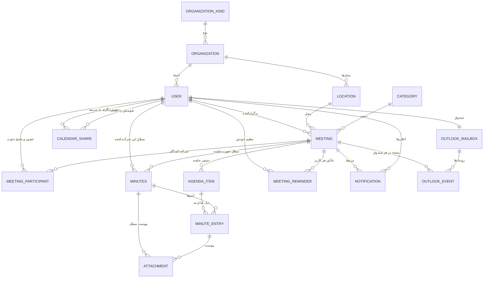

# مدل داده

هجده مدل، همه در `meetings/models.py`. این فایل نقشهٔ کلی است؛ برای جزئیات هر فیلد
خودِ `models.py` را بخوانید — تقریباً هر فیلدی که واضح نیست، بالایش توضیح دارد.

## رابطه‌ها

```mermaid
erDiagram
    ORGANIZATION_KIND ||--o{ ORGANIZATION : "نوع"
    ORGANIZATION      ||--o{ USER         : "اعضا"
    ORGANIZATION      ||--o{ LOCATION     : "محل‌ها"

    CATEGORY ||--o{ MEETING : "دسته"
    LOCATION ||--o{ MEETING : "محل"
    USER     ||--o{ MEETING : "برگزارکننده"

    MEETING ||--o{ MEETING_PARTICIPANT : "شرکت‌کنندگان"
    USER    ||--o{ MEETING_PARTICIPANT : "حضور و پاسخ دعوت"

    MEETING ||--o{ AGENDA_ITEM : "دستور جلسه"
    MEETING ||--o{ MINUTES     : "سطل صورت‌جلسه"
    USER    ||--o{ MINUTES     : "سطلِ این شرکت‌کننده"

    MINUTES      ||--o{ MINUTE_ENTRY : "آیتم‌ها"
    AGENDA_ITEM  ||--o{ MINUTE_ENTRY : "ذیل کدام بند"
    MINUTE_ENTRY ||--o{ ATTACHMENT   : "پیوست"
    MINUTES      ||--o{ ATTACHMENT   : "پیوست سطل"

    MEETING ||--o{ MEETING_REMINDER : "یادآور هر کاربر"
    USER    ||--o{ MEETING_REMINDER : "تنظیم خودش"

    USER    ||--o{ NOTIFICATION : "اعلان‌ها"
    MEETING ||--o{ NOTIFICATION : "مرتبط"

    USER ||--o{ CALENDAR_SHARE : "تقویمش را می‌دهد"
    USER ||--o{ CALENDAR_SHARE : "تقویم دیگری را می‌بیند"

    USER            ||--|| OUTLOOK_MAILBOX : "صندوق"
    OUTLOOK_MAILBOX ||--o{ OUTLOOK_EVENT   : "رویدادها"
    MEETING         ||--o{ OUTLOOK_EVENT   : "نسخه در هر صندوق"
```

`OtpCode` و `OutlookUnmappedAttendee` به هیچ‌چیز وصل نیستند و عمداً هم نباید باشند —
اولی با شمارهٔ موبایل کار می‌کند (پیش از اینکه کاربری وجود داشته باشد) و دومی
نشانی‌هایی را نگه می‌دارد که به هیچ کاربری نخورده‌اند.

## مدل‌ها

| مدل | کار |
|---|---|
| `OrganizationKind` | نوع سازمان (داخلی، بانک، رگولاتور…) — از پنل ادمین قابل تغییر |
| `Organization` | سازمان یا شرکت |
| `User` | کاربر و فرد؛ `AUTH_USER_MODEL`. `is_external=True` یعنی مهمان بدون حساب ورود |
| `Location` | محل جلسه، با آدرس و مختصات اختیاری |
| `Category` | دسته‌بندی جلسه، با رنگ |
| `Meeting` | جلسه — مرکز همه‌چیز |
| `MeetingParticipant` | جدول واسط جلسه↔کاربر؛ **پاسخ دعوت هر نفر روی همین سطر است** |
| `AgendaItem` | یک بند از دستور جلسه، با ترتیب و مدت |
| `Minutes` | «سطل» صورت‌جلسه به‌ازای هر شرکت‌کننده؛ `participant=None` یعنی عمومی |
| `MinuteEntry` | یک آیتم صورت‌جلسه: یادداشت، تصمیم، یادآور، تماس، نامه، فایل |
| `Attachment` | پیوست، روی سطل یا روی یک آیتم |
| `MeetingReminder` | تنظیم یادآور پیامکی هر کاربر برای هر جلسه، و رد ارسالش |
| `Notification` | اعلان درون‌برنامه‌ای |
| `OtpCode` | کد یک‌بارمصرف ورود؛ با شماره کار می‌کند نه با کاربر |
| `CalendarShare` | اشتراک تقویم، با پرچم اجازهٔ نوشتن صورت‌جلسه |
| `OutlookMailbox` | صندوق Outlook یک کاربر و نشانهٔ delta آن |
| `OutlookEvent` | همبستگی «جلسهٔ ما ↔ رویداد در یک صندوق مشخص» |
| `OutlookUnmappedAttendee` | نشانی‌ای که در دعوت آمد ولی به هیچ کاربری نخورد |

## چند تصمیم که در نمودار دیده نمی‌شود

**پاسخ دعوت روی سطر شرکت‌کننده است، نه روی جلسه.** پیش‌تر وضعیت جلسه این کار را
می‌کرد، یعنی «رد» یک نفر جلسه را برای همه لغو می‌کرد. حالا هرکس سطر خودش را دارد.

**صورت‌جلسه دو لایه دارد.** `Minutes` فقط یک سطل است که (جلسه، شرکت‌کننده) را به هم
وصل می‌کند؛ محتوای واقعی در `MinuteEntry` است. این اجازه می‌دهد هر شرکت‌کننده
صورت‌جلسهٔ خودش را داشته باشد بدون اینکه آیتم‌ها تکرار شوند.

**جلسه هیچ‌وقت حذف نمی‌شود.** لغو یعنی `status='cancelled'`. هرچه به جلسه وصل است
`CASCADE` دارد و یک `DELETE` خام، صورت‌جلسه و دستور جلسه و پیوست‌ها را با خودش
می‌برد.

**قیدهای یکتای Outlook تصادفی نیستند.** `OutlookEvent` دو `UniqueConstraint` دارد:
یکی روی (صندوق، شناسهٔ رویداد) و یکی که می‌گوید هر جلسه حداکثر **یک** نسخهٔ مرجع
(`is_authoritative`) دارد. دومی چیزی است که «جلسهٔ تکراری» را از «بعید» به
«ساختاراً ناممکن» می‌برد. `Meeting.outlook_uid` هم قید یکتای جزئی دارد (جلسه‌های
محلی که شناسه ندارند از آن مستثنا هستند).

**`CalendarShare` نمی‌گذارد کسی تقویمش را با خودش به اشتراک بگذارد** —
`CheckConstraint(~Q(owner=F('viewer')))` — و `UniqueConstraint(owner, viewer)` از
ردیف تکراری جلوگیری می‌کند.
